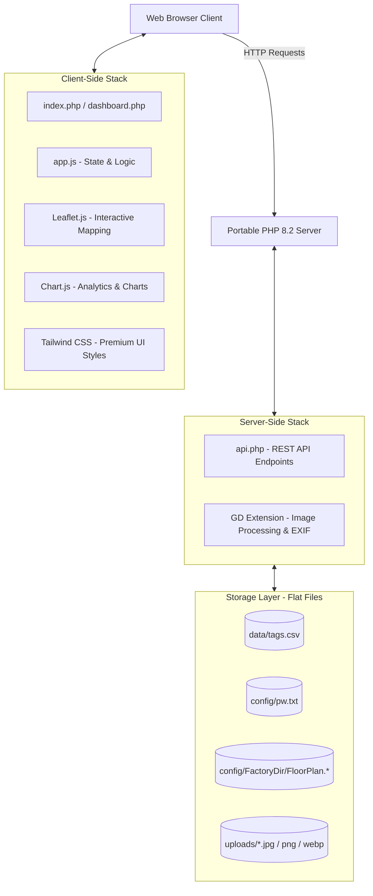

# 5S Red Tag System - Programmer Reference & Program Specification
**Developer Reference Manual & System Architecture Specification**  
*Document Version: 1.0.0*  
*Last Updated: June 1, 2026*  

---

## 1. System Overview

The **5S Red Tag System** is a lightweight, high-performance, and visually responsive web application designed to facilitate **5S audits** (specifically *Seiri* / Sort, *Seiton* / Set in Order, and *Seisou* / Shine) across manufacturing facilities. 

The application allows users to visually log, track, and resolve "Red Tag" issues (such as clutter, safety hazards, or dirty areas) by pinning them directly onto factory floor layout plans using interactive maps.

### Target User Profiles & Access Rights
*   **General User (No Password Required):**
    *   Add new Red Tags by clicking directly on the floor plan map.
    *   Update tag information (change status, add notes, upload photos).
    *   Move tags to correct physical coordinates.
    *   Filter tags by **Status** or **Zone** and export active data.
    *   Access the **Monitoring Dashboard** to analyze metrics.
    *   **Closing Restriction:** Changing a tag's status to **"Closed"** strictly requires entering a **Solution/Countermeasure** and uploading a **Photo (After)**.
*   **Admin User (Password Authorized):**
    *   Delete tags (soft delete, marked in data storage).
    *   Change/upload new Factory Floor Layout plans.
    *   **Authentication:** Single-factor authentication using a plaintext password stored in `config/pw.txt` (default is `5555`).

---

## 2. Technical Stack & Architecture

The system utilizes a **serverless flat-file architecture** optimized for high performance, low maintenance, and simple local portability (runs out-of-a-box via a standalone portable PHP execution environment).

### Architectural Diagram


### Client-Side Stack (Frontend)
1.  **Core Structure:** HTML5 & PHP server-side template pre-rendering.
2.  **Interactive Mapping:** **Leaflet.js (v1.9.4)**. Used to render a non-geographical coordinate system (`L.CRS.Simple`) over high-resolution image layouts.
3.  **Data Visualization:** **Chart.js (v4.x)**. Renders interactive KPI charts, area distributions, and historical trends on the dashboard.
4.  **Styling & UI:** **Tailwind CSS**. A customized precompiled stylesheet is loaded via `./dist/output.css`. Layout incorporates glassmorphism sidebars, premium micro-animations, and full responsiveness (supports mobile, tablet vertical, and desktop sizes).
5.  **Icon Library:** **Lucide Icons** (deferred loading).
6.  **State Management:** Vanilla Javascript (`app.js`) maintaining tags array, current filters, dynamic layout dimensions, and upload states.

### Server-Side Stack (Backend)
1.  **Language Runtime:** **PHP 8.2** (designed to run portably without standard system installation).
2.  **Image Processing:** **GD Library extension**. Used for server-side resizing, formats conversion, EXIF orientation corrections, and adaptive compression to meet file size bounds.
3.  **Data Storage:** Flat-file database (`data/tags.csv`) managed via atomic file streams and file locking (`flock`) to handle concurrent reads/writes safely.

---

## 3. Directory Structure

The application is structured logically to keep code, assets, client libraries, and configurations separated:

```text
5SRedTag/
│
├── .bin/                       # Portable PHP runtime environment (Windows executable)
│   └── php/
│       └── php.exe
│
├── .vscode/                    # VS Code environment configurations
│
├── BKUP/                       # Code backups & development snapshots
│
├── config/                     # Application configurations & layouts
│   ├── F10-11/                 # Factory F10-11 custom assets
│   │   ├── FloorPlan.png       # Active floor layout plan
│   │   └── FloorPlan_*.png     # Archived historical layouts (renamed with timestamps)
│   ├── F15/                    # Factory F15 custom assets
│   │   └── FloorPlan.png
│   └── pw.txt                  # Admin authentication password (plain text, default: 5555)
│
├── data/                       # CSV database and locks
│   ├── tags.csv                # Primary flat-file database (UTF-8 with BOM)
│   └── tags_temp.csv           # Temp file created during force-unlock procedures
│
├── dist/                       # Compiled assets
│   └── output.css              # Precompiled production Tailwind CSS stylesheet
│
├── js/                         # Client-side third-party JS libraries
│   └── chart.umd.min.js        # Minified Chart.js v4.x library
│
├── libs/                       # Localized dependencies
│   ├── leaflet/                # Leaflet.js mapping engine (assets, JS, CSS)
│   │   ├── leaflet.js
│   │   ├── leaflet.css
│   │   └── images/             # Leaflet marker icons
│   └── lucide/                 # Lucide icons library
│       └── lucide.min.js
│
├── uploads/                    # Red Tag uploaded images (compressed & optimized)
│   └── [unique_id].jpg         # Autogenerated unique filenames
│
├── index.php                   # Core application entrypoint (Interactive floor plan UI)
├── dashboard.php               # Monitoring & Analytics dashboard
├── api.php                     # Central backend API router (CRUD, auth, uploads)
│
├── clear_locks.php             # Diagnostic utility to release PHP process locks on CSV
├── force_unlock.php            # Recovery utility to force-nuke write locks on CSV
├── repro_save.php              # Debug/reproduction script for database saves
├── start_server.bat            # Windows startup script to spin up the local PHP server
│
├── package.json / package-lock.json  # NPM dev configurations (Vite, Tailwind compiles)
├── postcss.config.js           # PostCSS configuration
├── tailwind.config.js          # Tailwind CSS style configurations
├── vite.config.js              # Vite bundler configurations
└── README.md                   # Basic project guide
```

---

## 4. Data Storage & Schema Specs

### 4.1 Admin Password File (`config/pw.txt`)
Contains a single-line string of the plaintext password. On application startup, if `pw.txt` does not exist, `api.php` automatically instantiates it with the default value of `'5555'`.

### 4.2 Core Database Schema (`data/tags.csv`)
A flat-file comma-separated values format containing a UTF-8 Byte Order Mark (`\xEF\xBB\xBF`) at the file beginning for seamless opening in Microsoft Excel.

The database consists of **16 columns**. Older records (V1 to V3 schemas) are seamlessly migrated dynamically on load/save calls.

| Col # | Field Name | PHP Index | Data Type | Sample Value | Description |
|---|---|---|---|---|---|
| 1 | `id` | `0` | Integer / String | `1716612040` | Unique identifier (often Unix timestamp). |
| 2 | `x` | `1` | Float / Double | `423.50` | Map Y coordinate (Leaflet Latitude equivalent). |
| 3 | `y` | `2` | Float / Double | `728.12` | Map X coordinate (Leaflet Longitude equivalent). |
| 4 | `productionLine` | `3` | String | `Line A, Machine 2` | Free-text string describing the location. |
| 5 | `description` | `4` | String | `Excess oil spill under tray` | Description of the 5S problem. |
| 6 | `solution` | `5` | String | `Cleaned oil and placed absorption pads` | Solution/Countermeasure (Mandatory to close). |
| 7 | `status` | `6` | String (Enum) | `Open` | `Open`, `In Progress`, `Need help`, or `Closed`. |
| 8 | `image` | `7` | String (Path) | `uploads/6651ee2b.jpg` | Local file path to the "Before" photo. |
| 9 | `imageAfter` | `8` | String (Path) | `uploads/6651ff81.jpg` | Local file path to the "After" photo. |
| 10 | `zone` | `9` | String / Integer | `3` | Physical floor zone indicator (`1` to `11`). |
| 11 | `createdAt` | `10` | ISO Date Time | `2026-05-25 14:02:11` | Timestamp when the tag was registered. |
| 12 | `is_deleted` | `11` | Binary (`0` / `1`) | `0` | Active flag. `1` indicates soft deleted. |
| 13 | `updatedAt` | `12` | ISO Date Time | `2026-05-25 15:30:45` | Timestamp of the last modifications. |
| 14 | `pic` | `13` | String | `Somsak K.` | Person In Charge of resolving the tag. |
| 15 | `category` | `14` | String (Enum) | `Seisou (สะอาด)` | `Seiri (สะสาง)`, `Seiton (สะดวก)`, or `Seisou (สะอาด)`. |
| 16 | `factory` | `15` | String | `F15` | Factory layout identifier (`F10-11` or `F15`). |

---

## 5. Subsystems & Key Workflows

### 5.1 Interactive Floor Plan Mapping (`Leaflet.js`)
Since factory floor plans are not geographical coordinates, Leaflet's Simple Coordinate Reference System (`L.CRS.Simple`) is utilized. This translates image pixels directly into a flat coordinate system.
*   **Coordinate Bounds:** Scaled dynamically. When `FloorPlan` is loaded, a dummy image is instantiated in memory to fetch the image's `naturalWidth` (W) and `naturalHeight` (H).
*   **Bounds Definition:** The Leaflet map boundaries are configured as `[[0, 0], [naturalHeight, naturalWidth]]`.
*   **Marker Translation:** Leaflet markers map `latlng` directly to coordinates `[x, y]` representing pixel positions.

### 5.2 Retain & Hide Policy (Client-Side Filtering)
To avoid visual clutter on the live map, the application implements a data retention logic in `app.js` under the `getFilteredTags()` function:
*   **Active Map Tags:** Tags that are set to `Closed` are **automatically hidden from the map and list views** once they are **older than 10 days** (calculated from `createdAt` relative to current date).
*   **Dashboard Retention:** These older `Closed` tags are **never** removed from the CSV database (unless explicitly soft-deleted by an admin). This ensures historical data is retained permanently for KPI counts and dashboard trend analysis.

### 5.3 High-Res Image Optimization Pipeline
To prevent massive photo uploads from exhausting server disk space and slowing down layout load speeds, a dual-layer compression pipeline is enforced:

#### Phase 1: Client-Side Pre-Compression (`app.js`)
Before sending images to the server via AJAX, the client checks if the image exceeds `2MB`.
If true:
1.  Draws the image onto an offscreen HTML5 `<canvas>`.
2.  Scales the image proportionally such that the maximum width is capped at `800px`.
3.  Converts the image to `image/jpeg` with compression quality set to `0.5` (50%).
4.  Submits the compressed blob to the API as a lightweight upload.

#### Phase 2: Server-Side Processing & Optimization (`api.php`)
When a file hits the `upload` endpoint:
1.  **Format Constraints:** Limits file extensions to `jpg`, `jpeg`, `png`, `gif`, and `webp`.
2.  **EXIF Orientation Auto-Correction:** Reads JPEG EXIF orientation metadata (`exif_read_data`) and rotates the image (using `imagerotate`) if it was taken vertically on a phone.
3.  **Proportional Downscaling:** 
    *   *Red Tag photos:* Scaled proportionally down to a maximum width of `600px` and a maximum height of `450px`.
    *   *Floor Plans:* Scaled down to a maximum width of `2560px` to maintain legibility.
4.  **Target Size Optimization (Strict 150KB Limit):** 
    *   Saves the GD resource using an initial quality of `80%`.
    *   Iteratively checks the saved file size on disk (`clearstatcache`).
    *   If the size exceeds `150KB`, the system re-compresses the image, stepping down quality by `5%` on each iteration until it is under `150KB` or quality drops to `10%`.

---

## 6. Concurrency & File Lock Recovery

Because multiple auditors might access the system concurrently, file locking is utilized to prevent write collisions.

```text
Concurrent Client 1  ───► Exclusive Lock [LOCK_EX]  ───► Writes to tags.csv  ───► Unlocks [LOCK_UN]
                                                                                      │
Concurrent Client 2  ───► WAITS FOR LOCK ───────────► (Waits until unlock) ───► Exclusive Lock [LOCK_EX]
```

*   **Read Locking:** Shared locks (`LOCK_SH`) are applied when opening `tags.csv` for read (`r` mode).
*   **Write Locking:** Exclusive locks (`LOCK_EX`) are applied when opening the CSV database for writing (`c+` mode). The file is truncated and overwritten safely.

### Lock Recovery Subsystem
If a developer or admin opens the flat `data/tags.csv` file directly in Microsoft Excel, LibreOffice, or certain text editors on Windows, the operating system takes an exclusive OS-level system lock. This blocks the IIS/Apache/PHP server process from obtaining a lock, causing backend write failures.

Two diagnostic scripts are provided to recover from lock blockages:

#### 1. `clear_locks.php` (Graceful Release)
Attempts to acquire a write stream to `data/tags.csv` and explicitly triggers a PHP unlock (`LOCK_UN`). This clears locks lingering inside the PHP engine.

#### 2. `force_unlock.php` (Nuke OS Locks)
If the OS lock is held externally (e.g., file remains open in Excel):
1.  Attempts to copy `data/tags.csv` to `data/tags_temp.csv` (since read streams are usually bypassed by OS locks).
2.  Performs a validation check to make sure the copied file is not empty.
3.  Tries to execute a physical delete (`unlink`) on the original `data/tags.csv` file. If this fails, the script warns the developer that Excel has the file locked.
4.  If deleted successfully, it renames `data/tags_temp.csv` back to `data/tags.csv`, replacing the locked file pointer and freeing up write privileges instantly.

---

## 7. REST API Reference (`api.php`)

All API transactions are routed through `api.php` and receive/return JSON data. Action methods are declared using the query string param `?action=[ActionName]`.

### 7.1 Action: `check_password`
Validates admin credentials.
*   **Method:** `POST`
*   **Payload Type:** JSON
*   **Request Payload:**
    ```json
    { "password": "5555" }
    ```
*   **Response Payload (Success):**
    ```json
    { "success": true }
    ```

### 7.2 Action: `load`
Loads all active tags and current layout path.
*   **Method:** `GET`
*   **Query Parameters:**
    *   `factory` (Optional, defaults to `'F10-11'`. E.g., `api.php?action=load&factory=F15`)
*   **Response Payload:**
    ```json
    {
      "tags": [
        {
          "id": "1716612040",
          "x": 350.25,
          "y": 420.5,
          "productionLine": "Line B",
          "description": "Visual indicator bulb is blown",
          "solution": "",
          "status": "Open",
          "image": "uploads/6651ee2b.jpg",
          "imageAfter": null,
          "zone": "3",
          "createdAt": "2026-05-25 14:00:00",
          "updatedAt": "",
          "pic": "Andy R.",
          "category": "Seiton (สะดวก)",
          "factory": "F15"
        }
      ],
      "map": "config/F15/FloorPlan.png?v=1716612000"
    }
    ```

### 7.3 Action: `save`
Saves or updates a tag. 
*   **Method:** `POST`
*   **Payload Type:** JSON
*   **Request Payload:**
    ```json
    {
      "id": 1716612040,
      "x": 350.25,
      "y": 420.5,
      "productionLine": "Line B",
      "description": "Visual indicator bulb is blown",
      "solution": "Replaced bulb",
      "status": "Closed",
      "image": "uploads/6651ee2b.jpg",
      "imageAfter": "uploads/6651ff81.jpg",
      "zone": "3",
      "pic": "Andy R.",
      "category": "Seiton (สะดวก)",
      "factory": "F15"
    }
    ```
*   **Response Payload:**
    ```json
    { "success": true }
    ```

### 7.4 Action: `delete`
Soft-deletes a tag by setting its `is_deleted` flag to `1` in the database.
*   **Method:** `POST`
*   **Payload Type:** JSON
*   **Request Payload:**
    ```json
    { "id": 1716612040 }
    ```
*   **Response Payload:**
    ```json
    { "success": true }
    ```

### 7.5 Action: `upload`
Uploads and optimizes a Red Tag photo (Before or After).
*   **Method:** `POST` (Multi-part Form Data)
*   **Payload Type:** Multipart Form Data
*   **Form Parameters:**
    *   `file`: (Binary File Stream)
*   **Response Payload:**
    ```json
    { "path": "uploads/6652aa1c.jpg" }
    ```

### 7.6 Action: `upload_floor_plan`
Uploads a high-res factory floor plan layout, archives the previous layout with a timestamp, and saves the new one as standard name.
*   **Method:** `POST` (Multi-part Form Data)
*   **Form Parameters:**
    *   `file`: (Binary File Stream Layout Image)
    *   `factory`: (String Factory Identifier, e.g., `F15`)
*   **Response Payload:**
    ```json
    { "path": "config/F15/FloorPlan.png", "success": true }
    ```

---

## 8. Development & Extension Guidelines

### 8.1 Local Test Server Operation
Double-click `start_server.bat` in Windows Explorer. This launches the portable PHP server executable hidden inside `.bin/php/php.exe` on port `8000`. Keep this command prompt window open.
*   **Local URL:** [http://localhost:8000](http://localhost:8000)

### 8.2 Client-Side Asset Cache Busting
To ensure client browsers immediately pull updated JS or CSS code without relying on stale disk cache, always append a modification timestamp `?v=<?= filemtime(...) ?>` to static file link tags in PHP templates:
```php
<link href="./dist/output.css?v=<?= filemtime('./dist/output.css') ?>" rel="stylesheet">
<script src="app.js?v=<?= filemtime('app.js') ?>" defer></script>
```

### 8.3 Extending Factories & Zones
*   **Factories Dropdown:** To add or modify factory selections, locate the `<select id="factorySelect">` in `index.php` (line 173) and insert a new option element. The backend handles dynamic subdirectory configurations automatically under `config/[NewFactoryName]/`.
*   **Zones Configuration:** Map zones are controlled by the `<select id="filterZone">` dropdown in `index.php` (line 187) and the `<select id="zone">` dropdown in the modal form (line 255). Simply add or change zone options here.

---

## 9. Code Maintenance & Best Practices
1.  **Preserve Lock Mechanisms:** Never execute read/write streams on `data/tags.csv` without applying shared/exclusive locks (`flock`), otherwise concurrent writes will result in truncated or corrupt database files.
2.  **Maintain GD Dependency:** When deploying to production servers, ensure PHP has the `gd` extension enabled. Without GD, image uploads and downscalings will crash the backend.
3.  **Excel Compatibility:** Always prepend a UTF-8 BOM (`\xEF\xBB\xBF`) when writing headers back to `tags.csv` to keep Excel from rendering Thai characters or other non-ASCII strings as scrambled text.
